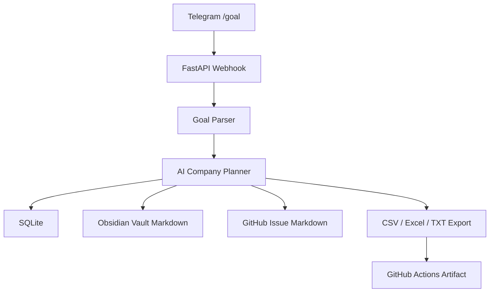

# Telegram AI Company Hub

Telegramから `/goal` を投げるだけで、AI会社のタスク分解、Obsidian風Markdownナレッジ保存、SQLiteへの履歴蓄積、GitHub Issue用Markdown生成、CSV/Excel/TXTエクスポートまで行うMVPです。

このリポジトリは、添付された構想「Telegram → Hermes → Obsidian → Paperclip → Claude/Codex → GitHub → Cloudflare」を、まず安全に動くローカル/Actions実行可能な形へ落とし込んだものです。

## 画像付き初期設定ガイド

初心者向けの画像付き手順は [`docs/setup.md`](docs/setup.md) にまとめています。


## できること

- Telegram webhook形式のUpdateを受け取るFastAPIサーバー
- `/goal` メッセージをAI会社タスクへ変換
- CEO / Research / Underwriter / Engineer / QA / Memory Librarian の役割テンプレート生成
- Obsidian Vault互換のMarkdownファイル生成
- SQLiteへgoals/tasks/eventsを保存
- GitHub Issueに貼れるMarkdownレポート生成
- CSV / Excel / TXT の実行結果エクスポート
- GitHub Actionsでテストとサンプル成果物artifact生成

## アーキテクチャ



詳細は [`docs/architecture.md`](docs/architecture.md) を参照してください。

## セットアップ

### Codespaces推奨

1. リポジトリをGitHub Codespacesで開く
2. 依存関係はdevcontainerで自動導入
3. 以下を実行

```bash
uvicorn app.main:app --reload --host 0.0.0.0 --port 8000
```

### ローカル

```bash
python -m venv .venv
source .venv/bin/activate
pip install -e '.[dev]'
pytest
uvicorn app.main:app --reload
```

## 環境変数

`.env.example` をコピーして使います。秘密情報はcommitしないでください。

```bash
cp .env.example .env
```

| Name | Required | 用途 |
| --- | --- | --- |
| `TELEGRAM_BOT_TOKEN` | optional | Telegram返信APIを使う場合 |
| `TELEGRAM_WEBHOOK_SECRET` | optional | webhook secret検証 |
| `APP_DB_PATH` | optional | SQLite保存先 |
| `OBSIDIAN_VAULT_PATH` | optional | Markdown vault出力先 |
| `GITHUB_REPOSITORY_TARGET` | optional | Issue化対象repo名メモ |

## Telegram webhookの使い方

TelegramのWebhook URLを `/telegram/webhook` に向けます。

```bash
curl -X POST http://localhost:8000/telegram/webhook \
  -H 'Content-Type: application/json' \
  -d @samples/telegram_goal_update.json
```

またはCLIでサンプル実行できます。

```bash
python -m app.cli run-sample --output-dir outputs
```

## API

### Health check

```bash
curl http://localhost:8000/health
```

### Goal登録

```bash
curl -X POST http://localhost:8000/goals \
  -H 'Content-Type: application/json' \
  -d '{"text":"/goal 不動産仕入れAI会社を起動。今日の候補調査をタスク化して"}'
```

## GitHub Actions

`.github/workflows/ci.yml` は以下を実行します。

- Python setup
- dependency install
- ruff format
- ruff lint advisory
- pytest
- サンプル成果物生成
- artifact upload

artifact名は `ai-company-hub-outputs` です。

## フォルダ構成

```text
app/
  main.py              # FastAPI entrypoint
  planner.py           # AI会社タスク分解
  storage.py           # SQLite保存
  obsidian.py          # Vault Markdown生成
  export.py            # CSV/Excel/TXT出力
  telegram.py          # Telegram Update parse/response
  cli.py               # サンプル実行CLI
samples/
  telegram_goal_update.json
docs/
  architecture.md
  setup.md
  images/
```

## 本番運用に必要なもの

- Telegram Bot Token
- HTTPS公開URL Cloudflare Tunnel / Cloudflare Workers / VPS reverse proxy等
- 永続SQLiteまたはD1/Supabase等のDB
- Obsidian Vaultの保存先 Git repoまたはVolume
- GitHub Issue作成まで自動化する場合はGitHub AppまたはPATを安全なSecretとして保存

## 安全設計

このMVPは、最初からmain pushや外部送信を自動化しません。AIはタスク、Issue本文、Markdown、成果物を作り、人間が必要箇所を確認できるようにします。

## 今後の拡張

- Paperclip API連携
- Hermes gatewayとの直接接続
- GitHub Issue自動作成
- Cloudflare D1/R2対応
- 物件調査用のURL根拠管理
- 銀行提出用Excelテンプレート
