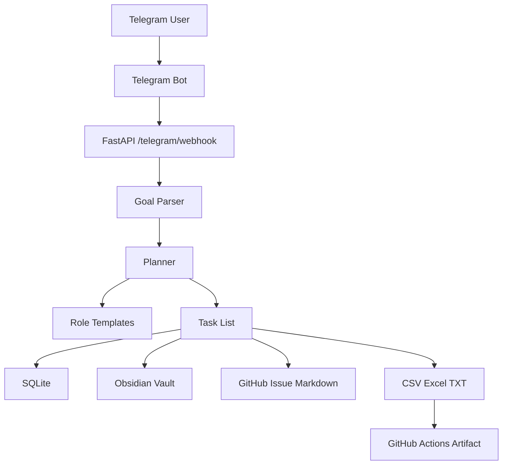
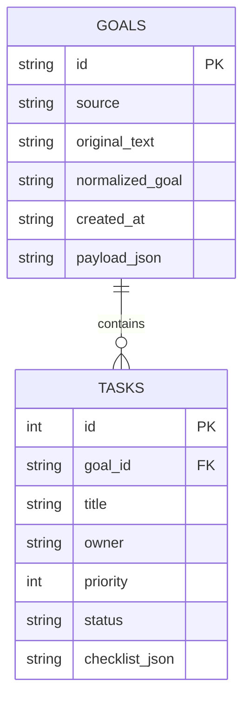
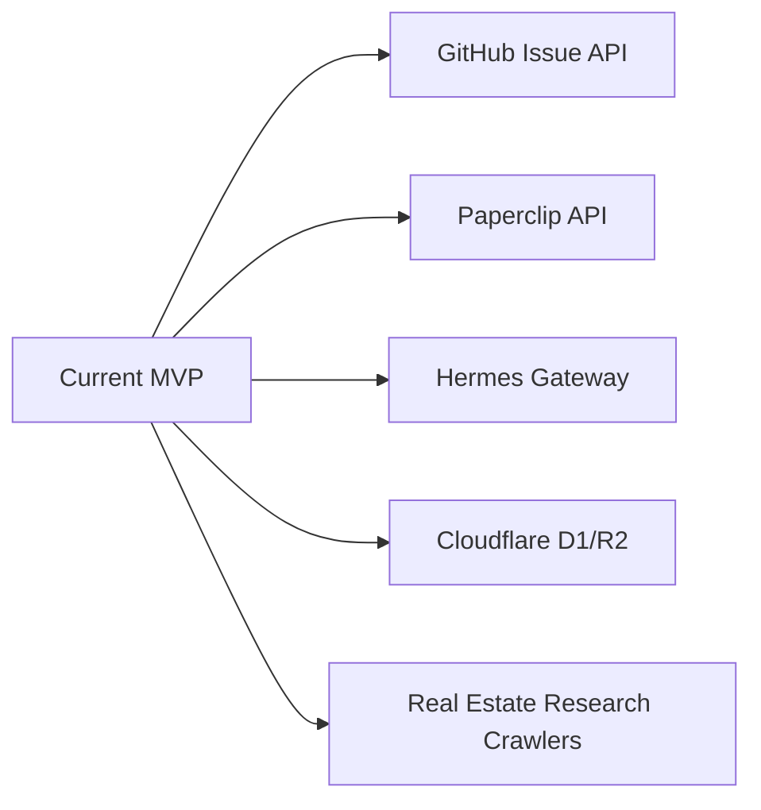

# Architecture

## 全体像

このMVPは、Telegramから投げられた `/goal` を、AI会社が実行できる構造化タスクへ変換し、Markdown / SQLite / CSV / Excel / TXT に保存する小さな司令塔です。

## コンポーネント

| Component | File | Role |
| --- | --- | --- |
| API | `app/main.py` | FastAPI endpoint |
| Planner | `app/planner.py` | goalをroles/tasks/issueへ変換 |
| Telegram | `app/telegram.py` | Telegram Updateから本文を抽出 |
| Storage | `app/storage.py` | SQLite保存 |
| Obsidian | `app/obsidian.py` | Vault互換Markdown生成 |
| Export | `app/export.py` | CSV/Excel/TXT生成 |
| CLI | `app/cli.py` | Actions/ローカルでサンプル実行 |

## データフロー

1. Telegramから `/goal ...` を送る
2. `/telegram/webhook` がUpdateを受け取る
3. `planner.plan_goal()` がAI会社タスクに分解
4. SQLiteへgoal/taskを保存
5. Obsidian Vault互換Markdownを生成
6. GitHub Issue本文とCSV/Excel/TXTを出力
7. Telegram向け返信JSONを返す

## DB

SQLiteを採用しています。最初は単一ファイルで十分です。本番ではCloudflare D1、Supabase、PostgreSQLへ移行可能です。

## Secrets

Secretsはコードに保存しません。

- `TELEGRAM_BOT_TOKEN`
- `TELEGRAM_WEBHOOK_SECRET`
- 将来の `GITHUB_TOKEN`
- 将来のCloudflare token

## CI/CD

GitHub Actionsは、push / pull_request / workflow_dispatchで起動します。

- checkout
- setup-python
- install dependencies
- ruff format check
- ruff lint
- pytest
- sample artifact generation
- artifact upload

## 今後の拡張

