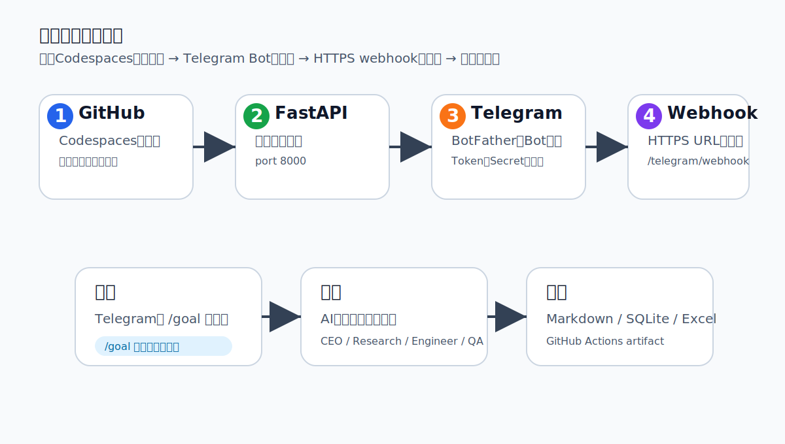
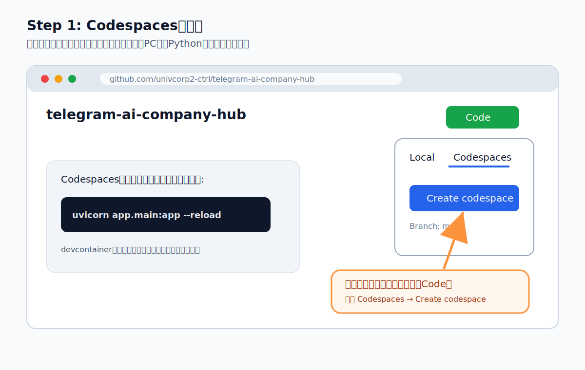
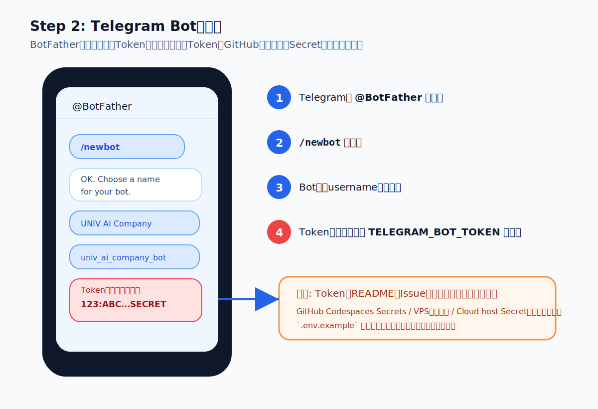
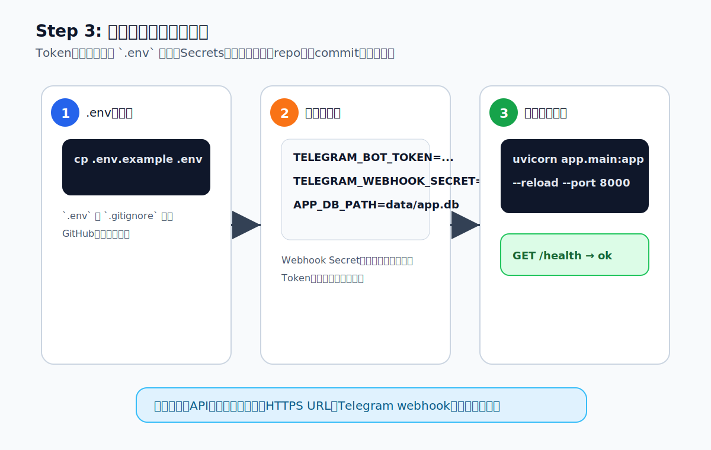
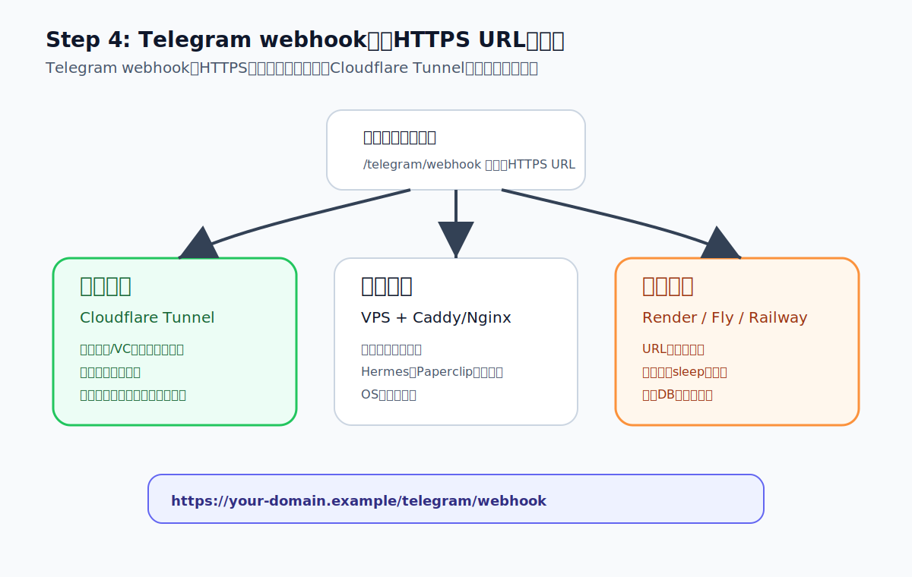
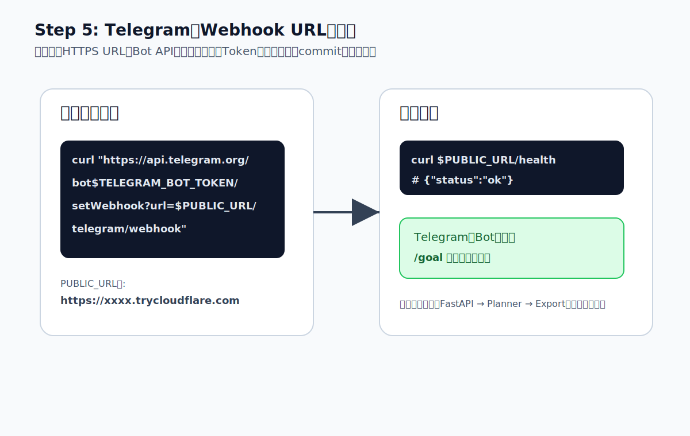
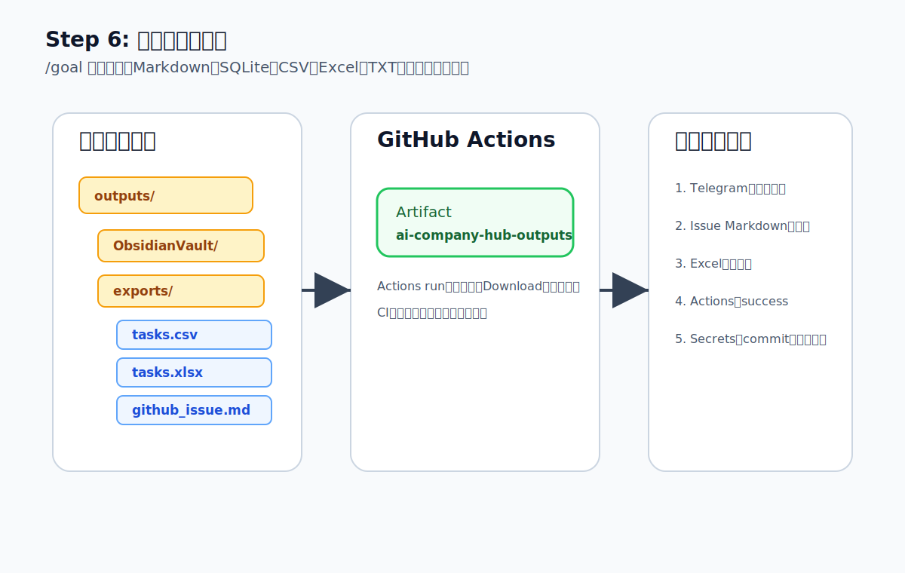

# Visual Setup Guide

このガイドは、Telegramから `/goal` を送ってAI会社タスクを生成するまでの初期設定を、画像付きで進めるための手順です。



## 0. 先に知っておくこと

このMVPは、いきなり外部送信や本番反映まではしません。まずは安全に、以下の成果物を作ります。

- Telegramから受け取ったgoal
- AI会社タスク一覧
- Obsidian Vault互換Markdown
- GitHub Issue用Markdown
- SQLite保存
- CSV / Excel / TXT出力
- GitHub Actions artifact

Secretsの実値はGitHubへcommitしません。`.env.example` には名前だけを書き、実値は `.env`、Codespaces Secrets、VPS環境変数、Cloud host secretsへ保存します。

---

## 1. GitHub Codespacesで開く

まずはローカルPCにPythonを入れず、Codespacesで動かすのが一番ラクです。



手順:

1. GitHub repoを開く
2. 右上の緑色 **Code** を押す
3. **Codespaces** タブを開く
4. **Create codespace on main** を押す
5. ターミナルが開いたら依存関係の導入を待つ

起動コマンド:

```bash
uvicorn app.main:app --reload --host 0.0.0.0 --port 8000
```

ヘルスチェック:

```bash
curl http://localhost:8000/health
```

期待値:

```json
{"status":"ok","service":"telegram-ai-company-hub"}
```

---

## 2. Telegram Botを作る

Telegramの `@BotFather` でBotを作ります。



手順:

1. Telegramで `@BotFather` を検索
2. `/newbot` を送信
3. Bot名を入力
4. Bot usernameを入力。例: `univ_ai_company_bot`
5. 表示されたTokenをコピー
6. Tokenは `TELEGRAM_BOT_TOKEN` としてSecretに保存

重要:

- TokenをGitHubへcommitしない
- TokenをREADMEやIssueへ貼らない
- Tokenをチャットに再掲しない
- `.env.example` にはTokenの名前だけを書く

---

## 3. 環境変数を入れて起動する

`.env.example` をコピーして `.env` を作ります。



```bash
cp .env.example .env
```

`.env` の例:

```bash
TELEGRAM_BOT_TOKEN=ここにBotFatherのToken
TELEGRAM_WEBHOOK_SECRET=自分で決めた長いランダム文字列
APP_DB_PATH=data/app.db
OBSIDIAN_VAULT_PATH=outputs/ObsidianVault
GITHUB_REPOSITORY_TARGET=univcorp2-ctrl/telegram-ai-company-hub
```

起動:

```bash
uvicorn app.main:app --reload --host 0.0.0.0 --port 8000
```

別ターミナルで確認:

```bash
curl http://localhost:8000/health
```

---

## 4. HTTPS webhook URLを作る

Telegram webhookにはHTTPS URLが必要です。最初はCloudflare Tunnelが一番簡単です。



選び方:

| 方法 | 向いている場面 | メモ |
| --- | --- | --- |
| Cloudflare Tunnel | 開発・検証 | 最初におすすめ |
| VPS + Caddy/Nginx | 安定運用 | Hermes / Paperclip同居にも向く |
| Render / Fly / Railway | 早く公開 | 無料枠sleepに注意 |

Cloudflare Tunnel例:

```bash
cloudflared tunnel --url http://localhost:8000
```

表示されたURLを控えます。

例:

```text
https://xxxx.trycloudflare.com
```

Webhook endpointはこれです。

```text
https://xxxx.trycloudflare.com/telegram/webhook
```

---

## 5. TelegramにWebhookを登録する

BotFatherで取得したTokenと、公開URLを使ってTelegram Bot APIへ登録します。



```bash
export TELEGRAM_BOT_TOKEN="BotFatherのToken"
export PUBLIC_URL="https://xxxx.trycloudflare.com"

curl "https://api.telegram.org/bot${TELEGRAM_BOT_TOKEN}/setWebhook?url=${PUBLIC_URL}/telegram/webhook"
```

Webhook secretを使う場合は、ホスティング側の環境変数 `TELEGRAM_WEBHOOK_SECRET` と同じ値をTelegram側にも指定します。

```bash
export TELEGRAM_WEBHOOK_SECRET="自分で決めた長いランダム文字列"

curl -X POST "https://api.telegram.org/bot${TELEGRAM_BOT_TOKEN}/setWebhook" \
  -H "Content-Type: application/json" \
  -d "{\"url\":\"${PUBLIC_URL}/telegram/webhook\",\"secret_token\":\"${TELEGRAM_WEBHOOK_SECRET}\"}"
```

---

## 6. Telegramからテストする

Botへ以下を送ります。

```text
/goal UNIV AI Real Estate Companyを起動。不動産仕入れ、融資、GitHub実装、Obsidian原液ナレッジ化を今日のタスクに分解して
```

期待される返信:

```text
AI会社に登録しました。goal_id=... / tasks=... / GitHub Issue用MarkdownとObsidianログを生成済みです。
```

---

## 7. 出力を確認する



ローカルまたはActions artifactに以下が生成されます。

```text
outputs/
  ObsidianVault/
    00_AI_COMPANY/
    10_REAL_ESTATE/
    90_LOGS/
  exports/
    *_summary.txt
    *_tasks.csv
    *_tasks.xlsx
    *_github_issue.md
```

サンプル実行:

```bash
python -m app.cli run-sample --output-dir outputs
```

GitHub Actionsでは、成功後に `ai-company-hub-outputs` artifactが生成されます。

---

## 8. よくある失敗

### Botに送っても反応がない

確認すること:

- FastAPIが起動しているか
- 公開URLが `/health` で返るか
- webhook URLが `/telegram/webhook` になっているか
- Telegram Bot Tokenが正しいか
- `TELEGRAM_WEBHOOK_SECRET` を設定した場合、Telegram側の `secret_token` と一致しているか

### `.env` をGitHubに上げそうで怖い

`.gitignore` に `.env` が入っています。念のためcommit前に以下を確認します。

```bash
git status
```

`.env` が表示されたらcommitしないでください。

### Codespacesでportが見えない

VS Code下部またはPortsタブで `8000` を公開します。ブラウザで `/health` を開いて確認します。

---

## 9. 本番運用に必要なもの

| 必要なもの | 用途 |
| --- | --- |
| `TELEGRAM_BOT_TOKEN` | Telegram Bot API |
| `TELEGRAM_WEBHOOK_SECRET` | webhookのなりすまし防止 |
| HTTPS公開URL | TelegramからFastAPIへ到達するため |
| 永続DB | SQLite / D1 / Supabase / PostgreSQL |
| Obsidian Vault保存先 | Git repo / Volume / Obsidian Sync |
| GitHub TokenまたはGitHub App | 将来のIssue/PR自動作成 |

---

## 10. 次に拡張するなら

1. GitHub Issue自動作成
2. Hermes gateway接続
3. Paperclip API接続
4. Cloudflare D1/R2保存
5. 物件調査・銀行提出用Excelテンプレート追加
